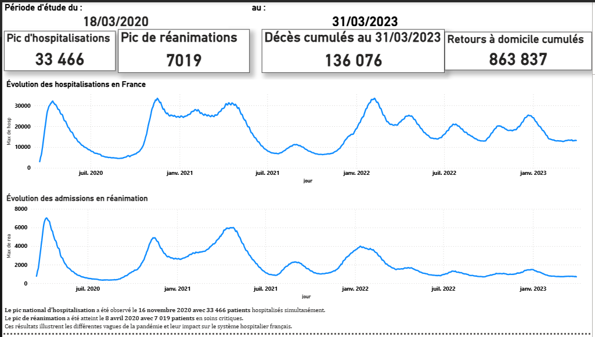
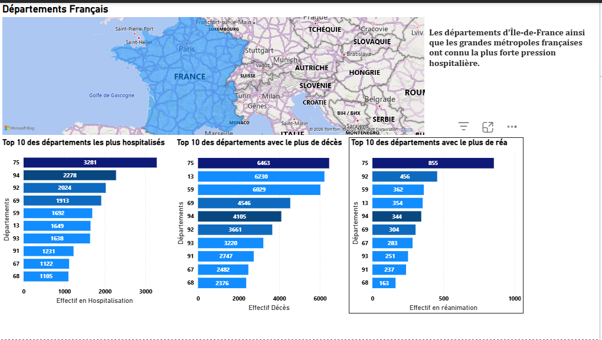
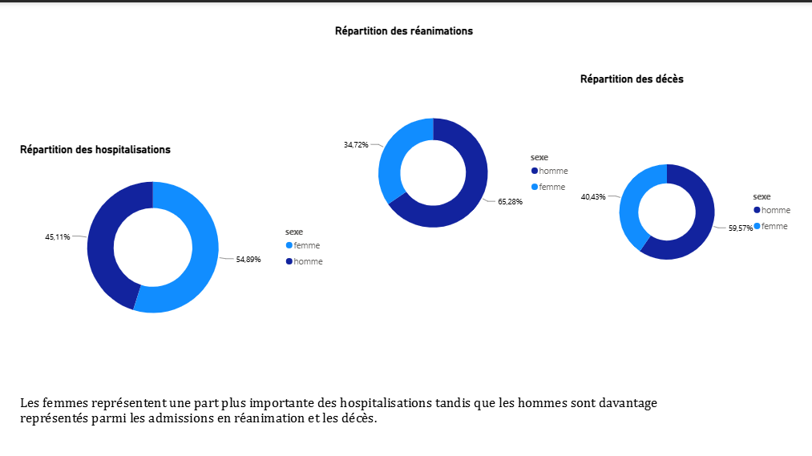
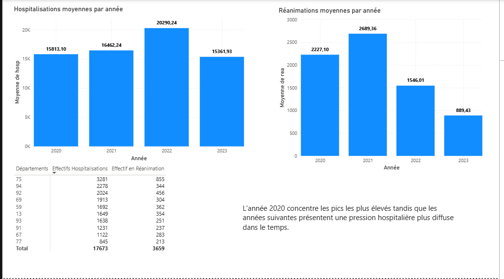

# dashboard sante publique france

## Objectif
Analyser des données de santé publique françaises afin de construire des indicateurs d'aide à la décision.

## Technologies

- Python
- Pandas
- SQL

Le dossier SQL a été préparé pour une future industrialisation du projet et l'automatisation des indicateurs.

- Power BI

## KPIs

- Nombre d'hospitalisations
- Nombre de décès
- Répartition régionale
- Évolution temporelle
- Autres données qui résulteront lors de l'analyse

## Dashboard - Vue d'ensemble

## Dashboard - Analyse géographique

## Dashboard - Sexe

## Dashboard - Analyse temporelle

##  Dashboard complet disponible dans le dossier docs.

## Statut

🚧 Projet en cours    
